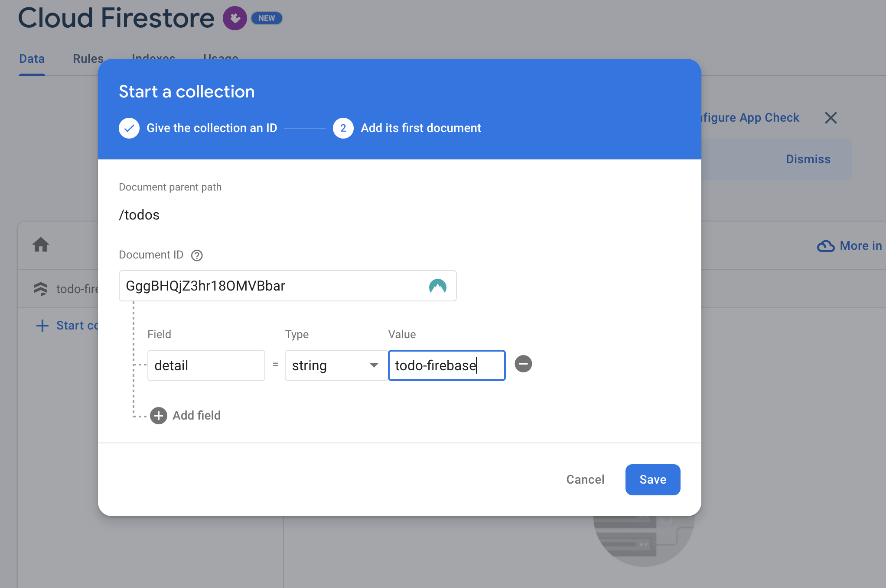

# todo-firebase

## how to rrun
- `yarn dev`

## Some Decisions

- Authentication
  
  時間が限られているため、Authenticationなしにします。

- Data fetching

  Firebase にSnapshot など Optimize された、Listener機能ありようですが、
  今回は単純なアプリなので、Add, Remove, Updateされたときに List を Query する形にしました。
- Pagination

  時間が限られているため、Paginationなしにします。
  その分、上限を10件に決定。
  すぐ10件になるため削除機能追加。

- UI

  時間が限られているため、できる限り最低限に

- Coding style

  時間が限られているため、できる限り最低限に

## How this code created

### 1. prep frontend
```sh
yarn create vite
yarn
yarn dev
```

### 2. prep Firebase
1. goto https://console.firebase.google.com/u/0/?pli=1
2. add project
3. add web app on firebase
4. `yarn add firebase`

### 3. connect firebase & ignore config
1. copy firebase config and add to `firebaseConfig.ts`
2. echo "\nsrc/firebaseConfig.ts" >> .gitignore

### 4. run debug mode and develop UI
- src/components/TodoList.tsx
- src/components/TodoListItem.tsx
- src/components/AddTodo.tsx

### 5. prepare firestore db
1. firestore -> create database
2. add collection


### 6. create data logics
- logics/*.ts

### 5. connect UI with firebase
App.tsx

